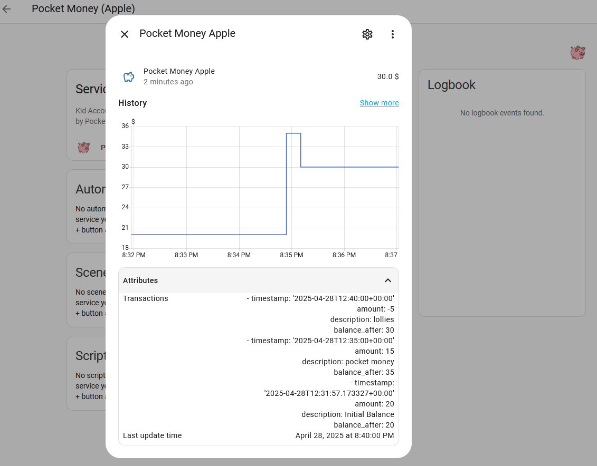

[](https://www.python.org/) [](https://paypal.me/samward271)
<!-- [](https://github.com/hacs/integration)-->
# Pocket Money
**Track your kids' pocket money balances and transaction history directly within Home Assistant.**

This integration allows you to create separate pocket money accounts for each child. It provides:

*   A `sensor` entity for each child displaying their current balance.
*   A `transactions` attribute on the sensor storing recent transaction history.
*   A service call (`pocket_money.kidname_add_transaction`) to easily add or subtract funds.
*   An optional feature to log all transactions to a CSV file per child.



---

## Installation
<!--
### Option 1: HACS (Home Assistant Community Store) - Recommended

1.  **If you don't have HACS installed:** Follow the HACS installation instructions [here](https://hacs.xyz/docs/configuration/basic).
2.  **Add Custom Repository:**
    *   Open HACS in your Home Assistant (usually in the sidebar).
    *   Go to "Integrations".
    *   Click the 3 dots in the top right corner and select "Custom repositories".
    *   In the "Repository" field, paste the URL to your GitHub repository: `https://github.com/sam-ward/ha-pocket-money`
    *   Select "Integration" as the category.
    *   Click "Add".
3.  **Install:**
    *   Search for "Pocket Money Tracker" in HACS.
    *   Click "Install".
    *   Follow the prompts.
4.  **Restart Home Assistant:** Crucial for the integration to be loaded.

*(Note: If this integration is ever added to the default HACS repository, step 2 becomes unnecessary.)*
-->
### <!--Option 2:--> Manual Installation

1.  Using the tool of choice (like Samba Share, VS Code Addon, etc.), copy the entire `pocket_money` directory from this repository into your Home Assistant `custom_components` directory.
    *   Your Home Assistant configuration directory might look like this:
        ```
        <config>/
        └── custom_components/
            └── pocket_money/
                ├── __init__.py
                ├── sensor.py
                ├── manifest.json
                ├── config_flow.py
                ├── const.py
                ├── services.yaml
                ├── helpers.py
                └── translations/
                     └── en.json
        ```
2.  **Restart Home Assistant.**

## Configuration

Configuration is done entirely via the Home Assistant UI. **You must add one instance of the integration for EACH child.**

1.  Navigate to **Settings** -> **Devices & Services**.
2.  Click **+ Add Integration**.
3.  Search for **"Pocket Money Tracker"** and select it.
4.  Fill in the configuration details:
    *   **Kid's Name:** The name of the child for this account (e.g., "Alice"). This determines entity names and the device name.
    *   **Currency Symbol:** The symbol to use (e.g., \$, £, €). Defaults to \$.
    *   **Initial Balance:** The starting balance for this child. Defaults to 0.0. This will also be recorded as the first transaction.
    *   **Max Transactions Stored:** How many recent transactions to keep in the sensor's attribute history. Defaults to 50.
    *   **Log Transactions to CSV File:** Toggle this **ON** if you want every transaction (not just the limited history in the sensor attribute) for this child appended to a CSV file in your Home Assistant `/config` directory. Defaults to OFF.
5.  Click **Submit**.
6.  **Repeat steps 2-5 for each child** you want to track.

**WARNING: A word of caution on the Max Transactions**
This integration was written with the intent of storing kids pocket money. That is, something that will change only a couple of times a week.

The transaction history is stored as an attribute of the entity. This means that any time the state changes (i.e. the balance), updated state and transaction history will be written to the recorder database.  Having the value of Max Transactions too large, or having too frequent transactions could cause the size of the recorder database to become very large.

The transaction history is only intended to show recent transactions as a memory jog.  If you need the full transaction listing, then turn on the **Log Transactions to CSV File option**.

---

## Features

### Sensor Entity

For each child added, a sensor entity will be created:
*   **Entity ID:** `sensor.pocket_money_kidname_balance` (e.g., `sensor.pocket_money_alice_balance`)
    *   *Note: `kidname` is a sanitized, lowercase version of the name entered during configuration.*
*   **State:** The current numerical balance.
*   **Unit of Measurement:** The currency symbol configured.
*   **Attributes:**
    *   `transactions`: A list containing the recent transaction history (up to the configured maximum). Each transaction is a dictionary with keys:
        *   `timestamp`: ISO 8601 timestamp string (UTC) of the transaction.
        *   `amount`: The amount added (positive) or subtracted (negative).
        *   `description`: Text description of the transaction.
        *   `balance_after`: The account balance *after* this transaction occurred.
    *   `last_update`: The timestamp of the last transaction applied.

### Service Call


A unique service is registered for each child instance to modify their balance:

*   **Service Name:** `pocket_money.kidname_add_transaction` (e.g., `pocket_money.alice_add_transaction`)
*   **Description:** Adds or subtracts an amount from the specific child's balance and records the transaction.
*   **Targeting:** It is **highly recommended** to call this service by targeting the **Device** associated with the child (e.g., "Pocket Money (Alice)") rather than calling the service name directly, especially in automations.
*   **Fields:**
    *   `amount` (Required): The numerical amount to add (positive) or subtract (negative).
    *   `description` (Optional): A text description for the transaction (e.g., "Weekly Allowance", "Bought Sweets"). Defaults to "Credit" or "Debit".
    *   `timestamp` (Optional): An ISO 8601 formatted timestamp string (e.g., `2023-10-27T10:30:00Z` or `YYYY-MM-DD HH:MM:SS`). If omitted, the current time (UTC) is used.
*   **Response:** The service returns the `new_balance` after the transaction is applied.

### CSV Logging (Optional)

*   If enabled during configuration for a child, every transaction (including the initial balance) will be appended to a dedicated CSV file.
*   **Filename:** `pocket_money_kidname.csv` (e.g., `pocket_money_alice.csv`)
*   **Location:** The file is created in your main Home Assistant configuration directory (where `configuration.yaml` resides).
*   **Format:** Standard CSV with headers: `timestamp`, `amount`, `description`, `balance_after`.

---

## Usage Examples

### Calling the Service (Developer Tools)

1.  Go to **Developer Tools** -> **Services**.
2.  Search for "Pocket Money". You should see the specific services listed (e.g., `pocket_money.alice_add_transaction`).
3.  Select the service for the child you want to update.
4.  Fill in the `amount` and optionally `description` and `timestamp`.
5.  Click **Call Service**.

**YAML Example:**

```yaml
service: pocket_money.alice_add_transaction
data:
  amount: 5.00
  description: Weekly Allowance

service: pocket_money.bob_add_transaction
data:
  amount: -2.50
  description: Bought Sweets
  timestamp: "2023-10-26T15:00:00Z" # Optional past timestamp
```

### Automation Example (Weekly Allowance)

This automation adds £5 allowance to Alice's account every Saturday morning. **Note:** It uses device targeting.

```yaml
alias: Weekly Allowance - Alice
description: Adds allowance every Saturday morning
trigger:
  - platform: time
    at: "09:00:00"
condition:
  - condition: time
    weekday:
      - sat # Run on Saturdays
action:
  - service: pocket_money.alice_add_transaction # You can use the name here...
    # ... but targeting the device is safer if the name changes
    target:
      device_id: <DEVICE_ID_FOR_ALICE> # Find this in Settings->Devices or via Dev Tools->States UI
    data:
      amount: 5.00
      description: Weekly Allowance
mode: single
```
*You can find the `device_id` by going to Settings -> Devices & Services -> Devices, finding the "Pocket Money (Alice)" device, and looking at the URL or Device Info.*

### Lovelace Display (Markdown Card)

Use this template in a Markdown card to display the recent transactions:

```jinja







  **Recent Transactions:**
  
    
    
      
      
        * **{{ unix_ts | timestamp_custom('%Y-%m-%d %H:%M', false) }}** - {{ tx.description | default('(No description)') }}
          * Amount: <font color='{{ "green" if tx.amount >= 0 else "red" }}'>{{ currency }}{{ '+' if tx.amount >= 0 }}{{ tx.amount | round(2) }}</font>
          * Balance: {{ currency }}{{ tx.balance_after | round(2) }}
      
        * Could not convert datetime to timestamp for transaction: {{ tx.timestamp }}
      
    
      * Could not parse timestamp string: {{ tx.timestamp }}
    
  

  Transaction attribute not found. Check entity ID: {{ entity_id }}

  No transactions recorded yet.

```
---

## Debugging

If you encounter issues, enable debug logging for this integration by adding the following to your `configuration.yaml` and restarting Home Assistant:

```yaml
logger:
  default: info # Or your preferred default level
  logs:
    custom_components.pocket_money: debug
```

Then check the logs under **Settings** -> **System** -> **Logs**.

---

## Contributions

Contributions are welcome! If you find a bug or have a feature request, please open an issue on the [GitHub repository Issues page][issues]. If you want to contribute code, please feel free to submit a Pull Request.

## License

This project is licensed under the Apache 2.0 License - see the [LICENSE](LICENSE) file for details.

<!-- Badges -->
[releases-shield]: https://img.shields.io/github/release/sam-ward/ha-pocket-money.svg?style=flat-square
[releases]: https://github.com/sam-ward/ha-pocket-money/releases
[license-shield]: https://img.shields.io/github/license/sam-ward/ha-pocket-money.svg?style=flat-square

<!-- Links -->
[issues]: https://github.com/sam-ward/ha-pocket-money/issues
[license]: LICENSE

## Acknowledgements
[Icon by vexels.com](https://www.vexels.com/png-svg/preview/263263/money-business-piggy-bank-icon)

## Donations
If you find this useful, any support you can provide would be greatly appreciated.
[](https://paypal.me/samward271)
